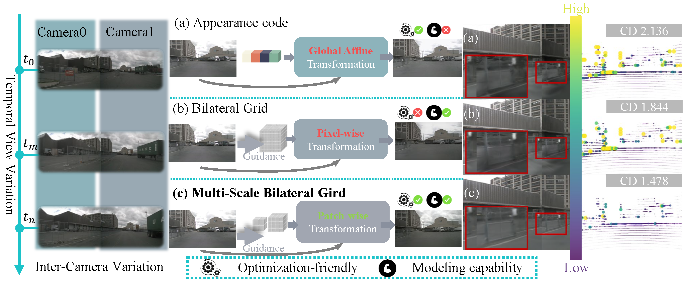

# Unifying Appearance Codes and Bilateral Grids for Driving Scene Gaussian Splatting

<div align="center">
<a href="https://arxiv.org/abs/2506.05280">
  
</a>
<a href="https://neurips.cc/">
  
</a>
<a href="https://bigcileng.github.io/bilateral-driving/">
    
</a>
</div>

This repository contains the official implementation of our **NeurIPS 2025** paper: [Unifying Appearance Codes and Bilateral Grids for Driving Scene Gaussian Splatting](https://arxiv.org/abs/2506.05280).

> Authors: [Nan Wang](https://bigcileng.github.io/), [Yuantao Chen](https://tao-11-chen.github.io/), [Lixing Xiao](https://li-xingxiao.github.io/homepage/), [Weiqing Xiao](https://scholar.google.com.hk/citations?user=v0iwkScAAAAJ), [Bohan Li](https://scholar.google.com/citations?user=V-YdQiAAAAAJ), [Zhaoxi Chen](https://scholar.google.com/citations?user=HsV0WbwAAAAJ), [Chongjie Ye](https://github.com/hugoycj), [Shaocong Xu](https://daniellli.github.io/), [Saining Zhang](https://scholar.google.com.hk/citations?hl=en&user=P4efBMcAAAAJ), [Ziyang Yan](https://ziyangyan.github.io/), [Pierre Merriaux](https://scholar.google.com.hk/citations?hl=en&user=NMSccqAAAAAJ), [Lei Lei](https://github.com/Crescent-Saturn), [Tianfan Xue](https://tianfan.info/) and [Hao Zhao](https://sites.google.com/view/fromandto/)<sup>†</sup>  

## ✨ News

- **September 18, 2025**: 🎉 **Paper accepted to NeurIPS 2025!**

- June 6, 2025: Release paper.

- June 5, 2025: Release preprocessed data and checkpoints.

- June 4, 2025: Release code and project page.

## 📊 Overview

<p align="center">
  
</p>

We introduce Multi-Scale Bilateral Grids that unify appearance codes and bilateral grids, significantly improving geometric accuracy in dynamic, decoupled autonomous driving scene reconstruction.

---

## 📋 Table of Contents

- [✨ News](#-news)
- [📊 Overview](#-overview)
- [🚀 Quick Start](#-quick-start)
  - [Environment Setup](#environment-setup)
  - [Dataset Preparation](#dataset-preparation)
- [🔧 Usage](#-usage)
  - [Training](#training)
  - [Evaluation](#evaluation)
  - [Rendering](#rendering)
- [📦 Preprocessed Data](#-preprocessed-data)
- [🤝 Citation](#-citation)
- [🙏 Acknowledgments](#-acknowledgments)

## 🚀 Quick Start

### Environment Setup

#### System Requirements

- **Python**: 3.9
- **PyTorch**: 2.2.0
- **CUDA**: 12.1
- **GPU**: NVIDIA GPU with at least 8GB VRAM (recommended: 16GB+)

#### Installation Steps

```bash
# Clone the repository
git clone --recursive https://github.com/BigCiLeng/bilateral-driving.git
cd bilateral-driving

# Create conda environment
conda create -n bilateraldriving python=3.9 -y
conda activate bilateraldriving

# Install PyTorch with CUDA support
conda install pytorch==2.2.0 torchvision==0.17.0 torchaudio==2.2.0 pytorch-cuda=12.1 -c pytorch -c nvidia

# Install requirements
pip install -r requirements.txt
pip install git+https://github.com/nerfstudio-project/gsplat.git@v1.3.0
pip install git+https://github.com/facebookresearch/pytorch3d.git
pip install git+https://github.com/NVlabs/nvdiffrast

# Install third-party dependencies
cd project/third_party/smplx/
pip install -e .
```

### Dataset Preparation

You can download our preprocessed [nuScenes](#preprocessed-data) data for quick start.

Download the dataset and arrange it as the following directory structure:

```
bilateral-driving/
├── data/
│   ├── nuscenes/
│   │   └── processed_10Hz/
│   │       └── ...
│   ├── argoverse/
│   │   └── ...
│   ├── pandaset/
│   │   └── ...
│   └── waymo/
│       └── ...
├── docs/
├── project/
└── ...
```

or following the same data preprocessing pipeline from [drivestudio](https://github.com/ziyc/drivestudio?tab=readme-ov-file#-prepare-data).

#### Quick Start Example

For a quick start, you can download the preprocessed nuScenes data and pre-trained models:

```bash
# Download preprocessed data (example for nuScenes)
# Place the downloaded data in the data/nuscenes/ directory

# Download pre-trained models
# Place the downloaded checkpoints in the ckpts/nuscenes_pretrained_checkpoints/ directory

# Run evaluation on a single scene
cd project
export PYTHONPATH=$(pwd)
python tools/eval_metrics.py \
    --resume_from ckpts/nuscenes_pretrained_checkpoints/checkpoint_final.pth
```

<details>
<summary>Click to expand data process instruction</summary>

- Waymo: [Data Process Instruction](docs/Waymo.md)
- NuScenes: [Data Process Instruction](docs/NuScenes.md)
- ArgoVerse: [Data Process Instruction](docs/ArgoVerse.md)
- PandaSet: [Data Process Instruction](docs/Pandaset.md)

</details>


## 🔧 Usage

### Training

#### Training Script
```bash
bash scripts/train.sh
```

#### Train a Single Scene

```bash
cd project
export PYTHONPATH=$(pwd)

python tools/train.py \
    --config_file configs/omnire_ms_bilateral.yaml \
    --output_root $output_root \
    --project $project \
    --run_name $expname \
    dataset=$dataset \
    data.scene_idx=$scene_idx \
    data.start_timestep=$start_timestep \
    data.end_timestep=$end_timestep \
    data.pixel_source.test_image_stride=$test_image_stride \
    data.pixel_source.load_smpl=$load_smpl
```

**Parameters:**
- `$output_root`: Path to save training outputs
- `$project`: Project name for logging
- `$expname`: Experiment name
- `$dataset`: Dataset name (e.g., nuscenes, waymo, pandaset, argoverse)
- `$scene_idx`: Scene index to train
- `$start_timestep`: Starting timestep
- `$end_timestep`: Ending timestep
- `$test_image_stride`: Test image stride
- `$load_smpl`: Whether to load SMPL data

> **Note**: For first-time users, we recommend starting with the nuScenes dataset using the provided preprocessed data and pre-trained models.

### Evaluation

Download the pre-trained model [checkpoints](#preprocessed-data) and arrange them as the following directory structure:

```
bilateral-driving/
├── ckpts/
│   ├── nuscenes_pretrained_checkpoints/
│   ├── pandaset_pretrained_checkpoints/
│   ├── waymo_pretrained_checkpoints/
│   └── argoverse_pretrained_checkpoints/
├── data/
├── docs/
├── project/
└── ...
```
#### Evaluation Script
```bash
bash scripts/eval.sh
```

#### Evaluate a Single Scene

```bash
cd project
export PYTHONPATH=$(pwd)

python tools/eval_metrics.py \
    --resume_from $output_root/checkpoint_final.pth
```

### Rendering

```bash
cd project
export PYTHONPATH=$(pwd)

python tools/render.py \
    --resume_from $output_root/checkpoint_final.pth
```


## 📦 Preprocessed Data

<table>
  <tr>
    <th>Dataset</th>
    <th>Resources</th>
    <th>Download Link</th>
    <th>Resources</th>
    <th>Download Link</th>
  </tr>
  <tr>
    <td rowspan="2">nuScenes</td>
    <td rowspan="2">preprocessed data</td>
    <td rowspan="2"><a href="https://1drv.ms/u/c/3121518754b90314/EbXMuvEABFJBs9YWkjaZ1v4BT8lJO_-9jwlF0dFsnyY2ww?e=7MVprz">Onedrive</a></td>
    <td>pretrained models (3cams)</td>
    <td><a href="https://1drv.ms/u/c/3121518754b90314/EUiCUpn_yNBPn503ACW9JZ4BvjQ-7Bt-sdPzVK74rBGxSw?e=v7yZDp">Google Drive</a></td>
  </tr>
  <tr>
    <td>pretrained models (6cams)</td>
    <td><a href="https://1drv.ms/u/c/3121518754b90314/ER4JaBD1xVdApbdwbIX-X1oB9iUclMNKcvt_SyCbfsNbww?e=uR6DLc">Google Drive</a></td>
  </tr>

  <tr>
    <td rowspan="2">Waymo</td>
    <td rowspan="2">preprocessed data</td>
    <td rowspan="2"><a href="https://1drv.ms/u/c/3121518754b90314/EQlVLB7_repFnAAYfLc7ZnUBLMg77z-siYq0s0oKcetGSg?e=gpXuzc">Onedrive</a></td>
    <td>pretrained models (3cams)</td>
    <td><a href="https://1drv.ms/u/c/3121518754b90314/EVx4-8cJW_FPvm9-hMgjBtQBHSSFbS1SPa2fMXZHhKermw?e=h2WNhU">Google Drive</a></td>
  </tr>
  <tr>
    <td>pretrained models (5cams)</td>
    <td><a href="https://1drv.ms/u/c/3121518754b90314/Ebcl2nzNLzVDgbNUOYCJ1VUBf3WdTuMsu58EjMFTof_d_A?e=upd0N0">Google Drive</a></td>
  </tr>

  <tr>
    <td rowspan="2">Pandaset</td>
    <td rowspan="2">preprocessed data</td>
    <td rowspan="2"><a href="https://1drv.ms/u/c/3121518754b90314/EW7xTaKEhKRDrq09H2-u6IABNPLOTycG5GNFre_A58NKHg?e=fefNbo">Onedrive</a></td>
    <td>pretrained models (3cams)</td>
    <td><a href="https://1drv.ms/u/c/3121518754b90314/EZBm-znrQ7JGme0Sv1eeOKUBEN0tiW4BpIu8dTpHmpWOOQ?e=EiVvfU">Google Drive</a></td>
  </tr>
  <tr>
    <td>pretrained models (6cams)</td>
    <td><a href="https://1drv.ms/u/c/3121518754b90314/EYvqRvPP-qdPgeTQvwbPPXUBiWwDJ2Ox71JuTJaNlDj7ow?e=YBGTWW">Google Drive</a></td>
  </tr>

  <tr>
    <td rowspan="2">ArgoVerse</td>
    <td rowspan="2">preprocessed data</td>
    <td rowspan="2"><a href="https://1drv.ms/u/c/3121518754b90314/EZzuCAudnKxCq8tX7h91qj0BOaKEsHlv3SVzlXnPYeTXJg?e=SFRz3C">Onedrive</a></td>
    <td>pretrained models (3cams)</td>
    <td><a href="https://1drv.ms/u/c/3121518754b90314/EWKNjaxqHKhHq2s_afuNv7QB_bzgqAfvZk-4GC7YLhKcLQ?e=0owtJg">Google Drive</a></td>
  </tr>
  <tr>
    <td>pretrained models (7cams)</td>
    <td><a href="https://1drv.ms/u/c/3121518754b90314/EbMDXidf09dPkFiORTZBqgUBsAgwxyq1eXIGx-ZMTJ8zxQ?e=FsUDNy">Google Drive</a></td>
  </tr>
</table>

# 🤝 Citation

If you find this repository helpful, please consider citing our paper:

```bibtex
@article{wang2025unifying,
  title={Unifying Appearance Codes and Bilateral Grids for Driving Scene Gaussian Splatting},
  author={Wang, Nan and Chen, Yuantao and Xiao, Lixing and Xiao, Weiqing and Li, Bohan and Chen, Zhaoxi and Ye, Chongjie and Xu, Shaocong and Zhang, Saining and Yan, Ziyang and others},
  journal={arXiv preprint arXiv:2506.05280},
  year={2025}
}
```

# 🙏 Acknowledgments

Thanks to these excellent open-source works and models: [DriveStudio](https://github.com/ziyc/drivestudio), [Bilarf](https://github.com/yuehaowang/bilarf), [Street Gaussians](https://github.com/zju3dv/street_gaussians).