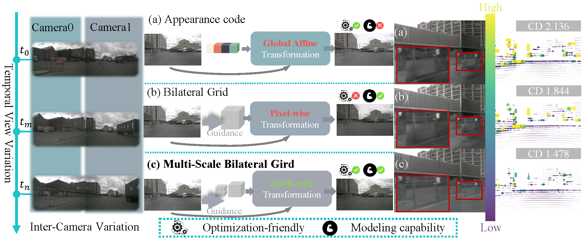

# Unifying Appearance Codes and Bilateral Grids for Driving Scene Gaussian Splatting

<div align="center">
<a href="">
  
</a>
<a href="">
    
</a>
</div>

This repo contains the official code of our paper: [Unifying Appearance Codes and Bilateral Grids for Driving Scene Gaussian Splatting]().

> Authors: [Nan Wang](https://bigcileng.github.io/), [Yuantao Chen](https://tao-11-chen.github.io/), [Lixing Xiao](https://li-xingxiao.github.io/homepage/), [Weiqing Xiao](https://scholar.google.com.hk/citations?user=v0iwkScAAAAJ), [Bohan Li](https://scholar.google.com/citations?user=V-YdQiAAAAAJ), [Zhaoxi Chen](https://scholar.google.com/citations?user=HsV0WbwAAAAJ), [Chongjie Ye](https://github.com/hugoycj), [Shaocong Xu](https://daniellli.github.io/), [Saining Zhang](https://scholar.google.com.hk/citations?hl=en&user=P4efBMcAAAAJ), [Ziyang Yan](https://ziyangyan.github.io/), [Pierre Merriaux](https://scholar.google.com.hk/citations?hl=en&user=NMSccqAAAAAJ), [Lei Lei](https://github.com/Crescent-Saturn), [Tianfan Xue](https://tianfan.info/) and [Hao Zhao](https://sites.google.com/view/fromandto/)<sup>†</sup>  

## ✨ News

- June 6, 2025: Release paper.

- June 5, 2025: Release preprocessed data and checkpoints.

- June 4, 2025: Release project page.

## 📊 Overview

<p align="center">
  
</p>

We introduced Multi-Scale Bilateral Grids that unifies appearance codes and bilateral grids, significantly improves geometric accuracy in dynamic, decoupled autonomous driving scene reconstruction.

---

## 🚀 Table of Contents

- [Environment Setup](#environment-setup)
- [Dataset Preparation](#Dataset-Preparation)
- [Evaluate the Pre-train Model](#evaluate-the-pre-train-model)
- [Train Your Model](#train-your-model)
- [Run Radar Simulation](#run-radar-simulation)
- [Downstream Tasks](#downstream-tasks)

### Environment Setup

First, create a new Conda environment and specify the Python version:

- python: 3.9.21
- pytorch: 2.2.0
- cuda: 12.1

```bash
## code
git clone --recursive https://github.com/BigCiLeng/bilateral-driving.git

## conda
conda create -n bilateraldriving python=3.9 -y
conda activate bilateraldriving

conda install pytorch==2.2.0 torchvision==0.17.0 torchaudio==2.2.0 pytorch-cuda=12.1 -c pytorch -c nvidia
pip install -r requirements.txt
pip install git+https://github.com/nerfstudio-project/gsplat.git@v1.3.0
pip install git+https://github.com/facebookresearch/pytorch3d.git
pip install git+https://github.com/NVlabs/nvdiffrast

## third party
cd third_party/smplx/
pip install -e .
cd ../..
```

### Dataset Preparation

You can download our preprocessed nuScenes data from [GoogleDrive]() for quick start.

Download the dataset and arrange it as the following directory tree,
```bash
|-- data
    |-- nuscenes
        |-- processed_10Hz
            ...
    |-- argoverse
        ...
    |-- pandaset
        ...
    |-- waymo
        ...
|-- docs
|-- project
...
```

or following the same data preprocessing pipeline from [drivestudio](https://github.com/ziyc/drivestudio?tab=readme-ov-file#-prepare-data).

<details>
<summary>Click to expand data process instruction</summary>

- Waymo: [Data Process Instruction](docs/Waymo.md)
- NuScenes: [Data Process Instruction](docs/NuScenes.md)
- ArgoVerse: [Data Process Instruction](docs/ArgoVerse.md)
- PandaSet: [Data Process Instruction](docs/Pandaset.md)

</details>

### Evaluate the pre-train models
```python
python tools/eval_chamfer.py \
    --resume_from $output_root/checkpoint_final.pth \
    render.render_test=False
```

### Train your model

#### train a single scene
```python
python tools/train.py \
    --config_file configs/omnire_ms_bilateral.yaml \
    --output_root $output_root \
    --project $project \
    --run_name $expname \
    dataset=leddartech/1cams \
    data.scene_idx=$scene_idx \
    data.start_timestep=$start_timestep \
    data.end_timestep=$end_timestep
```

# 🤝 Citation

If you find this repository helpful, please consider citing our paper:

```bibtex
todo
```
